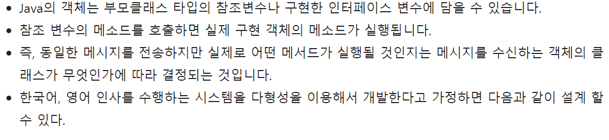
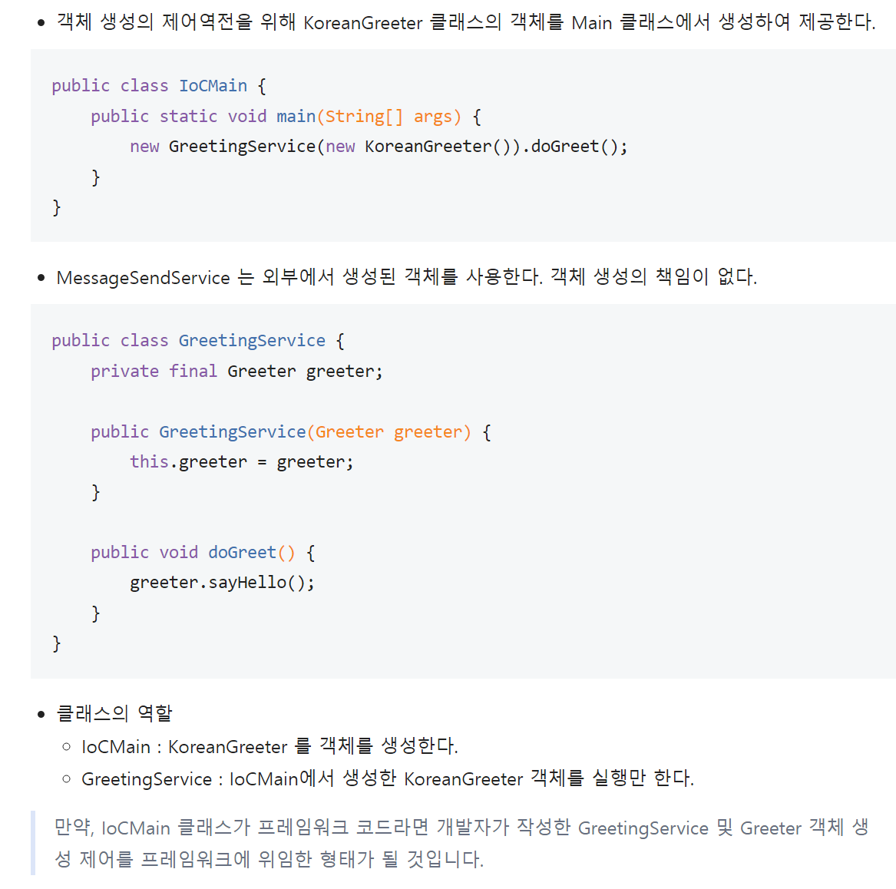

# 스프링 코어 개인 공부

1. 다형성 참조
    1. 

# Spring Inversion of Control

1. 제어역전 IoC
    1. 
    2. 

2. 의존성 Dependency
    1. 의존성 정의
    2. 코드에서 두 모듈간의 연결성을 의존성이라고 함.
    3. 객체지향언어에서 두 클래스 간의 관계를 말하기도 함.   
       위의 정의에서 알아본 모듈(module)이라는 말은 특정 기능별로 나누어지는 프로그램 덩어리 라고 생각된다.

3. 의존성의 종류
    1. 
    2. 
    3. 

```java
/*
        집합관계 설명.
        
 */
public class B {
    private int numB;

    public int getNumB() {
        return this.numB;
    }
}

public class A {
    private int numA;
    private B b;

    public A(B externalB) {
        this.b = externalB;
    }
}
```

```java
/*
        합성관계 설명. 집합관계 보다 강결합.
        클래스 A와 클래스 B의 LifeCycle 이 일치 한다.
 */
public class B {
}

public class A {
    private B b;

    public A(B externalB) {
        this.b = new B();
    }
}
```

Dependency Injection

1. DI는 디자인 패턴이다. 핵심 원칙은 의존성 이슈로 부터 행동을 분리 시키는 것이다.
2. DI는 IoC(의 구현일 뿐이다.
3. 외부에서 객체를 생성하고 전달한다.

# Spring Framework Dependency Injection

@Required

1. 의존성 주입이 반드시 성공해야 한다는 보장이 필요한 setter 메소드에 @Required 를 설정함.

@Autowired

1. XML 의 autowire 속성을 대신할 수 있음. setter 메소드에도 가능함.
2. setter 메소드가 없더라도 field 에 직접 @Autowired를 설정하여 의존성을 주입할 수 있음.

```java
import org.springframework.beans.factory.annotation.Autowired;

public class GreetingService {
    @Autowired
    private Greeter greeter;

    public void greet() {
        greeter.sayHello();
    }
}
```

3. Spring Framework는 생성자 방식으로 의존성을 주입합니다.
4. primary 속성 빈 설정에 primary 를 설정해 주면 같은 타입의 빈이 있더라도 우선 적용할 수 있다.

@Qulifier

1. 개발자가 직접 @Annotation 을 만들어 줄때 대부분 사용한다.

```java
import java.lang.annotation.ElementType;
import java.lang.annotation.Retention;
import java.lang.annotation.RetentionPolicy;
import java.lang.annotation.Target;
import org.springframework.beans.factory.annotation.Qualifier;

@Target({ElementType.FIELD, ElementType.TYPE_PARAMETER})
@Retention(RetentionPolicy.RUNTIME)
@Qualifier
public @interface Lang {
    String value();
}

```

```java
/*위의 Lang 어노테이션의 사용 방법. 
  @Qualifier 역할을 하도록 한다.
 */
 */
@Autowired
public GreetingProcessor(@Lang("english")Greeter greeter){
    this.greeter=greeter;
    }
```
@Lang 어노테이션을 동작하게 하려면 Bean 설정에서 Qualifier 설정을 추가한다.
```java
<bean id="englishGreeter"class="com.nhn.edu.springframework.ioc.helloworld.EnglishGreeter"scope="singleton"init-method="init">
    <qualifier type="com.nhn.edu.springframework.ioc.stereotype.Lang"value="english"/>
</bean>

<bean id="koreanGreeter"class="com.nhn.edu.springframework.ioc.helloworld.KoreanGreeter"scope="prototype"primary="true">
    <qualifier type="com.nhn.edu.springframework.ioc.stereotype.Lang"value="korean"/>
</bean>

```
#Java Configuration
1. Spring JavaConfig 클래스에는 @Configuration 어노테이션을 설정해야 함.
2. Spring JavaConfig 클래스는 @Bean 어노테이션을 설정한 메소드로 구성 됨.

```java
import org.springframework.context.annotation.Bean;
import org.springframework.context.annotation.Configuration;

@Configuration
public class JavaConfig {
   @Bean
   public String dbms(){
       return new String("MYSQL");
   }
}
//위의 @Configuration 어노테이션의 Bean 등록과 같음.
<bean id="dbms" class="java.lang.String">
    <constructor-arg type="java.lang.String" value="MYSQL" />
</bean>
```

#AnnotationConfigApplicationContext
AnnotationConfigApplicationContext의 성성자 파라미터로 받을 수 있는 클래스는 다음과 같다.
1. @Configuration 설정한 클래스
2. @Component 설정한 클래스
```java
// 생성자 파라미터에 basePackages(문자열)를 사용하면 
// 패키지 하위의 Component 설정한 클래스를 검색하여 등록함.
AnnotationConfigApplicationContext(String... basePackages);

public class AnnotationMain {
   public static void main(String[] args) {
      try( AnnotationConfigApplicationContext context = new AnnotationConfigApplicationContext("com.nhnacademy.edu.springframework")) {
         // do something ...
      }
   }
}
//xml configuration 설정을 사용할 수 있음.
@Configuration
@ImportResource("classpath:/xmlconfig/beans.xml")
public class MainConfig {
}
```

#빈 생성의 조건
@Conditional 어노테이션   
1. 조건에 따라 @Configuration 이나 @Bean 이 동작하거나 동작하지 않도록 설정할 수 있다.
2. @Conditional 은 @Condition 인터페이스 구현을 설정 해야 합니다.
3. Condition 인터페이스는 matches 메소드를 제공하는데, 반환값이 true 이면 설정은 동작함.   
  반대로 false 이면 설정은 동작하지 않음.

#Bean Scanning
Q.실제로 XML 이나 Java Configuration에서 비지니스 로직을 포함한 모든 bean을 일일이 등록해야 할 필요가 있을까?
Bean Scanning 을 이용한 방법이 그 해답이 될 수 있다.
Bean Scanning = Component Scanning = Classpath Scanning

```java
import org.springframework.context.annotation.ComponentScan;
import org.springframework.context.annotation.Configuration;

@Configuration
@ComponentScan(basePackages = "com.nhn.edu")
public class BeanConfig{
    // 구현부
}
```
Bean Scanning 의 대상이 되는 어노테이션들
1. @Configuration
2. @Component - 기본 스프링 관리 컴포넌트
3. @Controller - Spring Web Mvc 에서 Controller
4. @Service - Service layer 의 컴포넌트 마커
5. @Repository - Data Access Object를 의미하는 marker 어노테이션(Exception Translation 기능 제공)

Component Scan - Filter   
@ComponentScan 어노테이션은 includeFilters와 excludeFilters 속성으로 스캔할 대상
빈을 선발함.
```java
//정규식으로 "*Stub.*Repository " 는 포함하고 Repository.class 어노테이션이 설정된 클래스는 검색에서 제외합니다.
@Configuration
@ComponentScan(basePackages = "org.example",
        includeFilters = @Filter(type = FilterType.REGEX, pattern = ".*Stub.*Repository"),
        excludeFilters = @Filter(Repository.class))
public class AppConfig {
    // ...
}
```

#Aspect-Oriented Programming(관점 지향 프로그래밍.)
1. AOP 란 프로그램 구조를 다른 방식으로 생각하게 함으로써 OOP를 보완함.
2. OOP에서 모듈화의 핵심단위는 클래스이지만 AOP에서 모듈화의 핵심단위는 관점(aspect)임.
3. 관점은 다양한 타입과 객체에 걸친 트랜잭션 관리같은 관심(concern)을 모듈화 할 수 있게 합니다.
   1. crosscutting concerns : 횡단 관심사
   2. core concern : 주요 관심사

횡단 관심사 crosscutting concerns 를 분리하여 관점별로 각각 기능을 모듈화 할 수 있음.

4. Spring AOP 에서는 메소드 실행만 대상임.
   