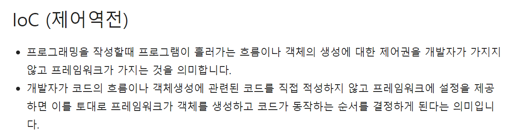

#스프링 코어 개인 공부

1. 다형성 참조
   1.    

#Spring Inversion of Control
1. 제어역전 IoC
   1. 
   2. 

2. 의존성 Dependency
   1. 의존성 정의   
   2. 코드에서 두 모듈간의 연결성을 의존성이라고 함.   
   3. 객체지향언어에서 두 클래스 간의 관계를 말하기도 함.   
         위의 정의에서 알아본 모듈(module)이라는 말은
         특정 기능별로 나누어지는 프로그램 덩어리 라고 생각된다.
   
3. 의존성의 종류
   1. 
   2. 
   3. 
```java
/*
        집합관계 설명.
        
 */
public class B{
   private int numB;
   
    public int getNumB() {
      return this.numB;
    }
}

public class A {
    private int numA;
    private B b;
    
    public A(B externalB) {
        this.b = externalB;
    }
}
```
```java
/*
        합성관계 설명. 집합관계 보다 강결합.
        클래스 A와 클래스 B의 LifeCycle 이 일치 한다.
 */
public class B {
}

public class A {
private B b;

    public A(B externalB) {
        this.b = new B();
    }
}
```
Dependency Injection

1. DI는 디자인 패턴이다. 핵심 원칙은 의존성 이슈로 부터 행동을 분리 시키는 것이다.
2. DI는 IoC(의 구현일 뿐이다.
3. 외부에서 객체를 생성하고 전달한다.

#Spring Framework Dependency Injection
